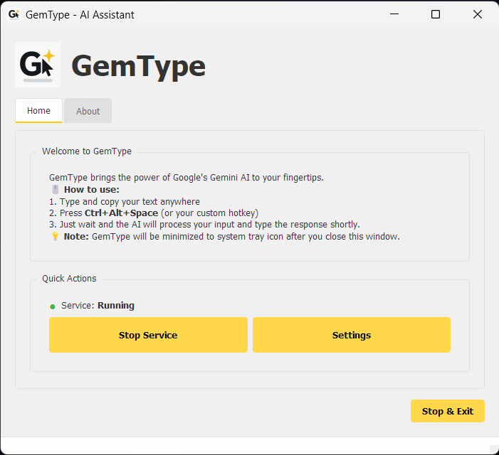

# GemType - AI Assistant

GemType is a desktop application that brings the power of Google's Gemini AI to your fingertips. With a simple hotkey, you can get AI assistance anywhere on your system.



## ✨ Features

- **Global Hotkey** - Trigger the AI assistant from anywhere (default: `Ctrl+Alt+Space`)
- **System Tray** - Runs in the background with a system tray icon
- **Easy Setup** - Simple configuration through a user-friendly interface
- **Customizable** - Change hotkeys, themes, and more
- **Lightweight** - Minimal system resource usage

## 🚀 Installation

### Prerequisites
- Python 3.8 or higher
- Windows 10/11 (Linux/macOS support coming soon)

### Method 1: From Source

1. **Clone the repository**
   ```bash
   git clone https://github.com/AlgoVoyager/gemtype.git
   cd gemtype
   ```

2. **Create and activate a virtual environment**
   ```bash
   python -m venv venv
   .\venv\Scripts\activate  # On Windows
   # or
   source venv/bin/activate  # On Linux/macOS
   ```

3. **Install dependencies**
   ```bash
   pip install -r requirements.txt
   ```

4. **Run the application**
   ```bash
   python main.py
   ```

### Method 2: Download Executable (Windows)

1. Download the latest release from the [Releases](https://github.com/yourusername/gemtype/releases) page
2. Run the installer or extract the portable version
3. Launch `GemType.exe`

## 🛠️ First Run Setup

1. On first launch, right-click the system tray icon and select "Settings"
2. Enter your [Google Gemini API key](https://aistudio.google.com/app/apikey)
3. Configure your preferred hotkey and other settings
4. Click "Save" and you're ready to go!

## 🎯 Usage

1. **Basic Usage**
   - Select text (optional)
   - Press `Ctrl+Alt+Space` (or your custom hotkey)
   - The AI will process your input and type the response

2. **System Tray**
   - Left-click: Show/hide the main window
   - Right-click: Access the context menu
   - Double-click: Show the main window

3. **Settings**
   - Change the hotkey
   - Toggle auto-start with Windows
   - Switch between light/dark/system theme
   - Configure notification preferences

## 🔧 Building from Source

To build your own executable:

```bash
# Install PyInstaller
pip install pyinstaller

# Build the executable
pyinstaller --onefile --windowed --icon=assets/icons/app_icon.ico main.py

# The executable will be in the 'dist' folder
```

## 🤝 Contributing

Contributions are welcome! Please feel free to submit a Pull Request.

1. Fork the repository
2. Create your feature branch (`git checkout -b feature/AmazingFeature`)
3. Commit your changes (`git commit -m 'Add some AmazingFeature'`)
4. Push to the branch (`git push origin feature/AmazingFeature`)
5. Open a Pull Request

## 📄 License

This project is licensed under the MIT License - see the [LICENSE](LICENSE) file for details.

## 🙏 Acknowledgments

- [Google Gemini](https://ai.google.dev/) - For the amazing AI
- [PyQt5](https://www.riverbankcomputing.com/software/pyqt/) - For the GUI framework
- [keyboard](https://github.com/boppreh/keyboard) - For global hotkey support
